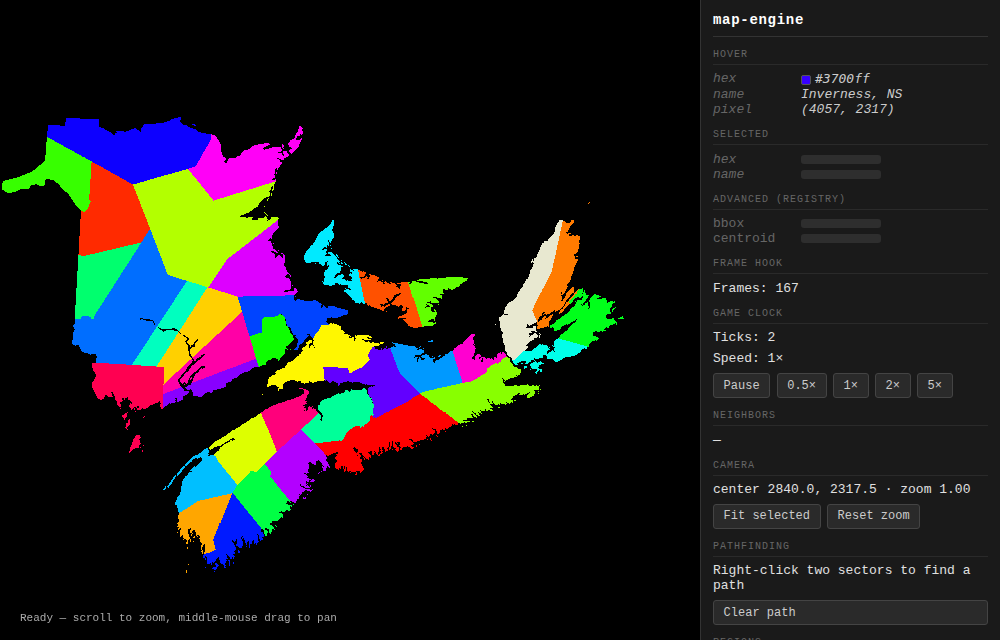

# map-engine

A small TypeScript library that draws an interactive grand-strategy map in the browser. You give it a PNG where every region is painted in its own flat color, plus a JSON file that names those colors. It gives you back a pannable, zoomable map where every region is a sector you can hover, click, recolor, and route across.

<!-- Screen recording of the example app goes here, in place of the image below. -->



## Why

Paradox games (EU4, HOI4, CK3) build their maps in a way I like. The map is just a bitmap. Each province is one RGB color, and a definitions file maps colors to data. That's it. The color _is_ the identity, so you can draw a new map in any paint program.

I wanted that pipeline on the web, as a plain library with no framework, no server, and no game engine attached. So this is me hacking on that.

## How it works

1. **Load.** `loadMap()` fetches the PNG and the JSON, decodes the bitmap to raw pixels, and scans it once. The scan gives each distinct color a small integer id and records each sector's bounding box, centroid, neighbors, and border contour.
2. **Draw.** The id of every pixel goes into one integer texture on the GPU. A fragment shader looks each id up in a palette texture, one texel per sector. So recoloring a sector, or swapping the whole map to a new map mode, is a write to the palette. No pixel is touched on the CPU.
3. **Pick.** A pointer event raycasts onto the map plane, turns the hit into a bitmap pixel, reads the id there, and emits the sector. That's how `sectorClick`, `sectorHover`, and `pick()` work.
4. **Think.** After the scan, the sector data moves into a Web Worker as transferable `ArrayBuffer`s. The worker runs A\* pathfinding, groups sectors into regions, finds label anchors inside each sector, and builds region borders, so none of that blocks the frame. No `SharedArrayBuffer`, so any static host (GitHub Pages, say) can serve it with no special headers.

Three.js is a peer dependency. The library itself is about 16 kB gzipped, worker included.

## Install

It's not on npm, so it installs from GitHub. Since npm 12, npm refuses a git dependency unless the project allows it, so allow git for your direct dependencies first:

```bash
echo 'allow-git=root' >> .npmrc
npm install three@^0.160.0 github:travisduffy/map-engine
```

npm builds `dist` during the install. For types, add `@types/three` as a dev dependency. To work from a local clone instead, see [the local route](docs/REFERENCE.md#installation) in the reference.

## Usage

```typescript
import { MapEngine } from 'map-engine'

// The canvas must be in the page and have a size before loadMap().
const canvas = document.getElementById('map') as HTMLCanvasElement
canvas.style.width = '800px'
canvas.style.height = '600px'

const engine = new MapEngine()

engine.on('sectorClick', ({ hexKey, sectorData }) => {
  console.log(`clicked ${sectorData.name} (${hexKey})`)
})

await engine.loadMap({
  bitmapUrl: '/map.png',
  definitionUrl: '/sectors.json',
  canvas,
})

engine.setSectorColor('ff0000', '#3399ff') // repaint one sector
```

Draw the bitmap with hard edges, no anti-aliasing, and no transparency, so that each pixel is exactly one color. The JSON is keyed by the hex color of each sector:

```json
{
  "ff0000": { "name": "Halifax, NS" },
  "b300ff": { "name": "Lunenburg, NS" }
}
```

`example/public/` holds a working pair that matches the code above. Everything else (map modes, pathfinding, regions, anchors, borders, the camera, events, errors, and the exact input rules) is in [docs/REFERENCE.md](docs/REFERENCE.md).

## The example app and the tests

```bash
git clone https://github.com/travisduffy/map-engine && cd map-engine
npm install
npm run example   # the example app on http://localhost:3000
```

The example app exercises every public feature.

The tests run in a real Chromium through Vitest and Playwright, so get the browser first:

```bash
npx playwright install chromium
npm test
npm run build     # builds dist and checks it
```

## Status

This is version 0.0.7 and a hobby project. Expect the API to break between versions. Browser only: it needs WebGL2, `OffscreenCanvas`, and `Worker`, and there's no SSR.

The known rough edges:

- The decode and the scan still run on the main thread. A 4096×4096 map stalls the page for about 2.1 s with 1,000 sectors and 3.3 s with 10,000. That's measured on a 2011 laptop, and it's the worst case.
- A mouse pans with a middle-button drag and zooms with the wheel. Touch pans with one finger and pinches to zoom. A trackpad can zoom but can't pan.
- A map holds at most 65,534 sectors.

The reference lists the rest, with the measurements behind them.

## The development log

This repo keeps its own history in [`log/`](log/), separate from git. Git history is easy to rewrite, and a commit message rarely says why. The log is plain text in the tree, so every clone carries the full record of what changed, why, and when.

- `log/events.log` is append-only, one event per line: `<id> <time> <body>`. The id is the SHA-256 of the body, so an edited body no longer matches its id. The time is Unix seconds. The body is one line, with `\\`, `\n`, `\r`, and `\t` escaped.
- `log/artifacts/` holds frozen files, like test output or a snapshot. Each one is named by the SHA-256 of its bytes, is never changed or removed, and is named by the line that adds it.
- Each commit adds exactly one line and changes no earlier one. A merge keeps every line of both parents and adds its own.
- Git merges the file with the `union` driver, so two branches that each add lines merge and rebase with no conflict.

`npm run commit` makes a commit with its line and artifacts, and `npm run check:log` replays the history and checks every rule. The first line points to a tarball of the plans, changelog, and agent notes from before the log existed.

## License

MIT. See [LICENSE](LICENSE).
