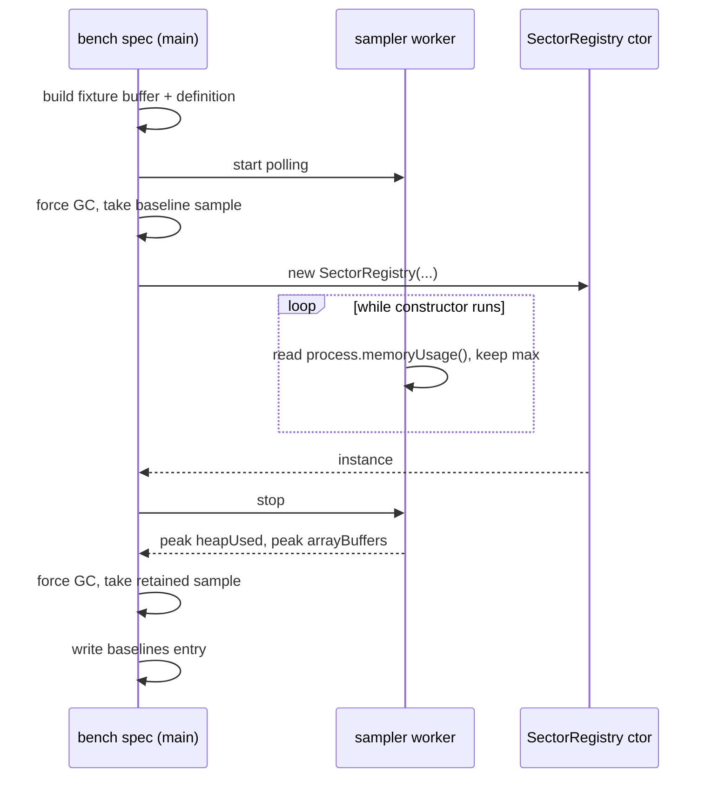
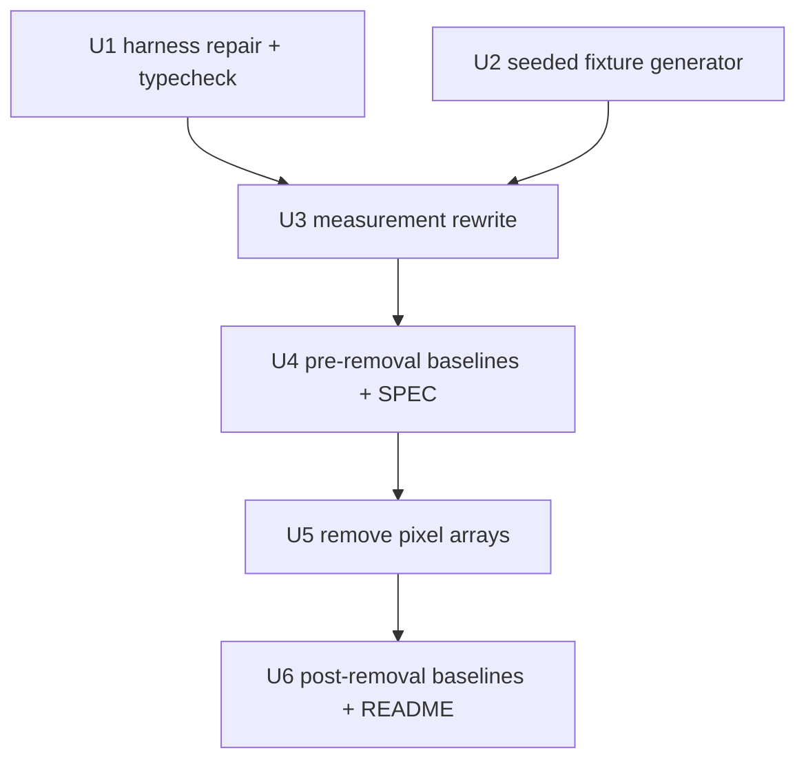

# Registry Scan Footprint - Plan

## Goal Capsule

- **Objective:** Make the cost of `SectorRegistry`'s O(W×H) scan measurable, then remove the largest allocation in it that serves no consumer.
- **Product authority:** `docs/vision.md` — PR-3 ("Performance Where It Earns It") governs. Optimizations without a measured impact on the hobbyist use case are rejected. Where this plan and the vision charter disagree, the charter wins.
- **Execution profile:** Six units in a near-linear chain (U1 and U2 are parallel; the rest sequence). The benchmark work lands before the registry change because R11 needs a before figure. Each unit is one commit's worth of change.
- **Stop conditions:** Stop and surface rather than guessing if the measured peak does not exceed the retained figure (the sampler is wrong, or the premise is), if removing the pixel lists shifts any other scan output, or if the size budget is breached.
- **Open blockers:** None. The threshold that would justify the deferred Worker relocation stays open by design — this plan produces the numbers that settle it.

---

## Product Contract

### Summary

Repair the dead `registry-alloc` benchmark and extend it to measure scan time and peak allocation against a representative multi-sector map. Then delete the per-sector pixel index arrays, replacing the recolor path's only use of them with the pixel count the scan already computes.

### Problem Frame

`README.md:519-520` states that `SectorBitmapParser.parse()` plus the `SectorRegistry` scan block the main thread for 200–500 ms on an 8192×4096 bitmap. That figure has no measurement behind it. It is prose, and downstream analysis has been treating it as data.

The one benchmark that could have grounded it is dead. `bench/registry-alloc.spec.ts` imports `../src/SectorRegistry` and `../src/types`; both paths moved to `src/sector/` and `src/shared/` during a module reorganization and the spec has not compiled since. Nothing catches this — the root `tsconfig.json` sets `include: ["src"]` and the Vitest config excludes `bench/**`, so no check in the post-task checklist compiles the benchmark. Even when it ran it measured the wrong thing twice over: it passed an empty definition (`{}`), which sets `sectorCount = 0` and zeroes every sector-proportional structure in the scan, and it sampled `process.memoryUsage().heapUsed` alone, which excludes ArrayBuffer backing stores. Neither counter is sufficient by itself: the transient pixel lists are V8-heap-resident while the retained typed arrays are ArrayBuffer-backed, so a benchmark watching only one of them is blind to roughly half the footprint. The recorded 16.3 MB baseline does not correspond to any structure the scan builds — `pixelIndices` alone is 67 MB at the fixture's actual 4096×4096.

Separately, the scan builds one JS array per sector and pushes every non-void pixel into it (`src/sector/SectorRegistry.ts:117`, `:156`), then converts all of them to `Uint32Array`s (`:244`) with both representations alive at that moment, and retains the result as `_sectorPixels` (`:327`). Inside the engine the only consumer is a null check: `MapRenderer.setSectorColor` and `resetSectorColor` (`src/core/MapRenderer.ts:275`, `:288`) call `getSectorPixels` and never read the returned array. The mobile heap sizing table in `README.md:523` — roughly 192 MB at the 4096×4096 cap — does not account for these arrays at all.

### Key Decisions

- **Measurement precedes the Worker relocation, and gates it.** Relocating the parse and scan into the Worker is the larger prize, and the direction is sanctioned — `docs/vision.md`'s "Worker-safe core" invariant exists precisely to keep that option open. But PR-3 rejects optimizations with no measured impact, and no measurement exists. That work is deferred behind this one, not abandoned; its shape is recorded under Scope Boundaries.

- **The representative fixture is 10,000 sectors.** PR-3 names "10,000 sectors at 60fps" as the concrete GSG target, so the benchmark inherits it rather than inventing a number. The existing `test/fixtures/maps/large.png` is 4096×4096 but its definition (`large.json`) holds a single entry, so it exercises none of the per-sector structures this work targets.

- **The benchmark fixture is generated in-process as a raw buffer, not a committed PNG.** `SectorRegistry`'s constructor takes a `Uint8ClampedArray` directly, so a seeded generator can write the RGBA bytes and skip PNG encoding entirely — avoiding both a committed multi-megabyte fixture and the heap noise a `sharp` encode/decode round trip would add to the very measurement being taken. `test/fixtures/borders/generate-perimeter-cases.js` is the precedent for deterministic scripted fixture construction, but its PNG outputs are git-tracked; this fixture is never written to disk.

- **Peak allocation matters more than retained allocation.** The moment both the JS arrays and their `Uint32Array` conversions are alive is where most of the removal's benefit sits. A benchmark reporting only post-construction retention would undersell the change and could wrongly conclude it isn't worth making. Because the constructor is one synchronous block with no yield point, the peak can only be observed from outside the thread running it.

- **`getSectorPixels` is deleted rather than preserved.** Nothing in the engine reads its return value for data. This is a single-developer private repo, so public-surface compatibility is not a constraint on the decision.

### Requirements

**Measurement**

- R1. `bench/registry-alloc.spec.ts` compiles and runs against the current module layout, and `bench/` is brought under a typecheck run so a future module move fails a check rather than silently deadening the benchmark again.
- R2. The benchmark exercises a 4096×4096 bitmap paired with a ~10,000-sector definition, generated in-process from a fixed seed as a raw RGBA buffer. Every pixel is assigned to a sector — zero void — so the reported figures are an explicit upper bound, and the non-void coverage fraction is recorded alongside the measurement method.
- R3. The benchmark reports the V8 heap component and the ArrayBuffer-backed component as separate figures at each sample point.
- R4. Peak-during-scan and retained-after-construction are reported separately. Peak is sampled by an out-of-band observer — a Node worker thread polling `process.memoryUsage()` on a fixed interval while the constructor runs on the benchmark's main thread — with the polling interval and resulting sampling resolution recorded.
- R5. The retained sample is taken after a forced garbage collection, with `--expose-gc` supplied by the `bench:registry-alloc` script; the benchmark fails loudly rather than silently skipping when `global.gc` is unavailable.
- R6. The benchmark reports scan wall-clock time using best-of-N sampling, with the sample count and the Playwright timeout set to accommodate a multi-second scan at the R2 fixture size.
- R7. `bench/SPEC.md` and `bench/baselines.json` reflect the new measurement method. The stale 16.3 MB entry is replaced, and `baselines.json` carries separate pre-removal and post-removal keys so R11's comparison survives the second run.

**Retained pixel lists**

- R8. `SectorRegistry` stops building and retaining the per-sector pixel index arrays.
- R9. The recolor precondition is served by a retained per-sector pixel count derived from the counter the scan already maintains at `src/sector/SectorRegistry.ts:115`.
- R10. `getSectorPixels` is removed from `SectorRegistry`, along with its test block at `test/SectorRegistry.test.ts:106-140`.
- R11. Baselines are captured before and after R8-R10 so the change's effect is recorded as a number.

### Acceptance Examples

- AE1. Zero-pixel sector.
  - **Covers R9.** **Given** a definition entry whose colour appears nowhere in the bitmap, **when** `setSectorColor` is called for it, **then** it warns and no-ops exactly as today.
- AE2. Normal sector.
  - **Covers R9.** **Given** a sector present in both bitmap and definition, **when** `setSectorColor` is called for it, **then** the palette entry is written and the renderer marks itself dirty.
- AE3. Unknown key.
  - **Covers R9.** **Given** a hex key absent from the definition, **when** `resetSectorColor` is called for it, **then** it warns and no-ops.

### Success Criteria

- The benchmark yields before-and-after figures for scan time, peak allocation, and retained allocation at 4096×4096 — a number to point at in place of the scan half of the README's estimate. The decode half is not covered: the Node benchmark harness cannot exercise `SectorBitmapParser`, so `README.md:519-520` is rewritten to attribute its residual unverified time to the decode path rather than treated as fully replaced.
- `README.md`'s mobile heap sizing at 4096×4096 is either corrected against the measured figures or confirmed accurate. Because that paragraph points at `docs/archive/ROADMAP.md` §12.3, which is frozen, the README requalifies the pointer as a superseded historical estimate rather than the archive being edited.
- The recolor and reset paths behave identically; `test/MapRenderer.test.ts` passes without modification.

### Scope Boundaries

#### Deferred for later

- Moving PNG decode and the registry scan into the Worker, gated on this work's measurements. The shape, recorded here so it survives without a separate document: invert the load direction so the Worker builds the registry in place and ships Main only what Main-side consumers read — `pixelIndices` for the GPU index texture, `pixelIndicesMirror` for context-loss recovery, and the bbox / centroid / adjacency buffers the proxy snapshot serves — while the Worker retains contour and border state for its own handlers. `SectorRegistry` would need to be constructible from a prebuilt payload without rescanning, which is a second constructor path rather than a change to the scan itself. `fetch` stays on the main thread with the Worker receiving raw bytes, keeping the consumer's caching, cancellation, and credential semantics and leaving the `Blob` input path that `SectorBitmapParser.parse` already supports reachable. The `BOOTSTRAP` / `BOOTSTRAP_ACK` protocol is what changes.
- Chunking the scan with cooperative yields on the main thread, using the existing `yieldIfNeeded` helper (`src/worker/yield.ts`, which depends only on `MessageChannel` and `performance.now` and therefore runs on either thread). This is the smaller alternative to the Worker relocation and should be weighed against it once the numbers land, not before.

#### Out of scope

- `SharedArrayBuffer` transport — settled non-goal under PR-1.
- Any change to the `LOAD`/`BOOTSTRAP` worker protocol, `MapEngine.loadMap`'s signature, or the example app.
- Reducing `pixelIndices` or `pixelIndicesMirror`; both have live consumers.

### Dependencies and Assumptions

- The 200–500 ms figure in `README.md:519-520` is treated as unverified. R1-R7 exist to replace its scan half.
- The benchmark harness runs in Node under Playwright, where `createImageBitmap` and `OffscreenCanvas` do not exist. `SectorBitmapParser`'s decode path therefore cannot be exercised there at all, which is why the Success Criteria covers only the scan.
- The ~192 MB heap sizing in `README.md:523` is assumed to understate actual usage, because it lists the source buffer, `pixelIndices`, and the mirror but not the per-sector pixel arrays. The benchmark settles it.
- No new dependency is needed. The fixture is built as a raw buffer in-process, so `sharp` is not involved; it remains a devDependency for the existing test fixtures only.
- The size estimates below are unverified and are the benchmark's job to confirm or refute. They are recorded to show why the per-sector arrays are the suspected prize, not as findings.

| Structure                                                       | Estimated size at 4096×4096 | Lifetime                                 |
| --------------------------------------------------------------- | --------------------------- | ---------------------------------------- |
| `sourceBuffer` (`Uint8ClampedArray`, W×H×4)                     | ~67 MB                      | Disposed after scan                      |
| `pixelIndices` (`Uint32Array`, W×H)                             | ~67 MB                      | Retained                                 |
| `pixelIndicesMirror` (`Uint16Array`, W×H)                       | ~34 MB                      | Retained                                 |
| `sectorPixelLists` (`number[][]`, one entry per non-void pixel) | ~134 MB                     | Transient, peaks alongside the row below |
| `_sectorPixels` (`Uint32Array[]`, one entry per non-void pixel) | ~67 MB                      | Retained                                 |
| Per-sector buffers (bboxes, centroids, counters)                | Sector-proportional, small  | Retained                                 |

A single exploratory run at the R2 fixture size, taken while reviewing this document, put the scan at 8.4 s with a 208 MB heap delta, a 194 MB ArrayBuffer delta, and 588 MB peak RSS. That was one unrepeated sample on a contended container with no forced GC — directional support for the premise, not a baseline, and R1-R7 exist to produce the real figures. It does suggest the transient estimate above is closer to right than low, and it sets the scale the R6 timeout budget has to absorb.

### Outstanding Questions

All three planning-owned questions are resolved in the Planning Contract below — see KTD4 (harness stays on Node), KTD5 (no 8192×4096 point), and U4 (the Node-vs-browser equivalence is recorded as a stated assumption in `bench/SPEC.md`).

**Deferred until measurements exist**

- What scan time or peak-allocation figure would justify the Worker relocation. Setting a threshold before there is a measurement to compare against would be inventing the answer. Non-blocking: this plan produces the numbers that answer it.

### Sources and Research

- `docs/vision.md` — First-Class Principles; PR-3 supplies both the rejection rule and the 10,000-sector target. The "Worker-safe core" invariant sanctions the deferred relocation.
- `src/sector/SectorRegistry.ts:115` (`centCount`, incremented per pixel at `:153`, currently a discarded constructor local), `:117`/`:156`/`:244`/`:327` (pixel-list build, push, conversion, retention), `:375` (`getSectorPixels`).
- `src/core/MapRenderer.ts:275`, `:288` — the null-check-only consumers.
- `bench/registry-alloc.spec.ts` — dead imports, empty definition, `heapUsed` sampling, and a `global.gc()` guard that never fires because `package.json`'s `bench:registry-alloc` script passes no `--expose-gc`. `bench/playwright.config.ts` runs it single-worker with a 120 s timeout.
- `tsconfig.json` (`include: ["src"]`) and `vite.config.ts` (`test.exclude` covering `bench/**`) — why the dead benchmark survived a release unnoticed.
- `test/fixtures/maps/large.png` (4096×4096) and `large.json` (one entry). `test/fixtures/borders/generate-perimeter-cases.js` is the precedent for deterministic scripted fixtures, though its outputs are committed.
- `.claude/rules/testing.md` — perf-gate design rules for this contended dev box, including environment-aware tolerance and best-of-N sampling.
- `src/shared/types.ts:71` — `ISpatialRegistry` carries only bbox / neighbors / centroid, and `SectorRegistry` is its sole implementer, so removing `getSectorPixels` needs no interface change.

---

## Planning Contract

**Product Contract preservation:** unchanged. Planning resolved three questions the requirements left to this stage and recorded the answers as KTD4, KTD5, and a U4 assumption; no requirement text or R-ID moved.

### Key Technical Decisions

- KTD1. **Peak allocation is sampled from a Node worker thread, not from inside the constructor.** `SectorRegistry`'s constructor (`src/sector/SectorRegistry.ts:65-343`) is one synchronous block with no `await`, yield, or timer, so nothing on its own thread can observe the moment the `number[][]` lists and their `Uint32Array` conversions are both alive. A polling observer on a second thread can. Instrumenting the constructor was rejected: the peak is bench-only information, and sampling hooks in library code work against both the size budget and the "composable, not invasive" invariant in `docs/vision.md`.

- KTD2. **The fixture is a raw RGBA buffer built in-process, never a PNG on disk.** The constructor's first parameter is a `Uint8ClampedArray`, so PNG encoding buys nothing and costs a `sharp` encode plus decode of a 67 MB buffer inside the process whose memory is being sampled.

- KTD3. **Both memory counters are reported at every sample point.** The transient pixel lists live in the V8 object heap; the retained typed arrays live in ArrayBuffer backing stores. An exploratory run put those at 208 MB and 194 MB respectively, so either counter alone hides roughly half the footprint.

- KTD4. **The benchmark stays on the Node/Playwright harness, and decode stays unmeasured.** `SectorBitmapParser` decodes through `createImageBitmap` and `OffscreenCanvas`, neither of which exists in Node. Reaching the decode path would mean moving `bench/` to Vitest browser mode — a harness rewrite for a measurement the deferred Worker relocation will need on its own terms.

- KTD5. **No 8192×4096 measurement; the README claim is rewritten instead of matched.** The repo treats 4096×4096 as the mobile cap and sizes its heap budget there. At roughly 8.4 s per scan, doubling the fixture roughly doubles per-sample cost to produce a number whose only job is retiring one sentence. Rewriting the sentence to the measured cap is the cheaper honest move.

- KTD6. **Two sector-count points, not one.** A single 10,000-sector extreme gives the deferred relocation threshold a value with no slope. A second point near 1,000 sectors costs one extra run once the generator exists and shows whether cost tracks sector count or pixel count.

- KTD7. **Baselines land before the removal.** R11 needs a before figure and the removal deletes the structure being measured, so the benchmark work sequences ahead of the simpler change.

### High-Level Technical Design

The peak sampler is the one piece whose shape prose carries poorly — it spans two threads and the ordering matters:

Unit dependencies — U1 and U2 are independent, everything after is a chain:

### Assumptions

- Scan wall-clock measured in a Playwright-hosted Node process is treated as representative of browser main-thread blocking. The scan is pure JS over typed arrays with no DOM dependency and both hosts run V8, but this is a stated assumption rather than a proven equivalence — U4 records it in `bench/SPEC.md` so a later reader knows it was assumed, not measured.
- The exploratory 8.4 s / 208 MB / 194 MB figures came from one unrepeated run on a contended container. They size the timeout budget and nothing else; every recorded baseline comes from the real benchmark.

---

## Implementation Units

### U1. Repair the benchmark and bring `bench/` under typecheck

**Goal:** the benchmark compiles and runs again, and a future module move fails a check instead of silently deadening it.

**Requirements:** R1

**Dependencies:** none

**Files:** `bench/registry-alloc.spec.ts`, `tsconfig.bench.json` (new), `package.json`, `CLAUDE.md`

**Approach:** repoint the two dead imports to `src/sector/SectorRegistry` and `src/shared/types`. Add a bench-scoped tsconfig extending the root — it cannot simply inherit, since the root sets `include: ["src"]` and a DOM-flavoured `types` array while `bench/` is Node under Playwright. Wire a `typecheck:bench` script and add it to CLAUDE.md's post-task checklist Batch 1 beside the two existing typechecks. New code compiles under the root's `erasableSyntaxOnly`, `verbatimModuleSyntax`, and `noUnusedLocals`.

**Patterns to follow:** `tsconfig.build.json` for the extends-and-override shape; `example/`'s workspace typecheck script for how a second typecheck surface is wired.

**Test scenarios:** `Test expectation: none — build configuration and an import repair, with no behavioural surface. Its proof is the Verification check below.`

**Verification:** `npm run typecheck:bench` passes; repointing an import at a nonexistent path makes it fail rather than pass silently; `npm run bench:registry-alloc` runs end to end.

### U2. Seeded fixture generator

**Goal:** produce a deterministic raw RGBA buffer and matching definition at a configurable sector count, with every pixel assigned to a sector.

**Requirements:** R2

**Dependencies:** none

**Files:** `test/fixtures/generate-registry-fixture.ts` (new), `test/generate-registry-fixture.test.ts` (new)

**Approach:** a pure function taking seed, width, height, and sector count and returning the buffer, dimensions, and definition. Assign every pixel to a sector so coverage is total and the reported figures are an explicit upper bound, and guarantee each declared sector receives at least one pixel so the load-time zero-pixel warn loop stays quiet. Sector colours are distinct RGB triples excluding `000000`, which `.claude/rules/sectors.md` reserves for void. Keys are lowercase hex without `#`, matching `toHexKey`. The module lives under `test/fixtures/` rather than `bench/` because `vite.config.ts` excludes `bench/**` from Vitest, so a generator placed there could not be tested; both the bench spec and the test import it from there.

**Patterns to follow:** `test/fixtures/borders/generate-perimeter-cases.js` for deterministic scripted construction; `src/shared/utils.ts` `toHexKey` for key formatting.

**Test scenarios:**

- A 4×4 / 4-sector request returns a buffer of length `width * height * 4` with alpha 255 at every pixel.
- Every key in the returned definition appears at least once in the buffer.
- No pixel carries the void colour `000000`.
- The same seed produces byte-identical buffers across two calls; a different seed produces a different buffer.
- A `SectorRegistry` built from a 64×64 / 16-sector output reports 16 sectors and emits no zero-pixel warning.
- A sector count exceeding the pixel count is rejected rather than silently producing zero-pixel sectors.

**Verification:** the new test file passes under `npm run test`; the bench spec imports the generator and constructs a registry from it without warnings.

### U3. Rewrite the measurement

**Goal:** report heap and ArrayBuffer components separately at both a peak and a retained sample point, alongside scan wall-clock, with forced GC and best-of-N sampling.

**Requirements:** R3, R4, R5, R6

**Dependencies:** U1, U2

**Files:** `bench/registry-alloc.spec.ts`, `bench/playwright.config.ts`, `package.json`

**Approach:** follow the sequence in the High-Level Technical Design above. The sampler worker polls `process.memoryUsage()` and keeps the maximum `heapUsed` and `arrayBuffers` it observes while the constructor runs. Retained figures come from a before/after delta with a forced collection immediately preceding the after-sample; `--expose-gc` arrives via `NODE_OPTIONS` in the `bench:registry-alloc` script, and the spec throws when `global.gc` is undefined rather than skipping the collection the way the current guard does. Scan time brackets the constructor and keeps the minimum across N samples, since contention only ever makes a run slower. Raise the Playwright timeout to cover N scans at both fixture sizes.

**Execution note:** the cross-thread sampler is the piece most likely to be silently wrong. Prove it early by confirming a run reports a peak strictly above its retained figure — that gap is the entire premise, and a sampler that misses it reads as "no benefit."

**Patterns to follow:** `.claude/rules/testing.md` on best-of-N and keeping the minimum under contention.

**Test scenarios:** `Test expectation: none — the benchmark is the measurement instrument rather than a unit under test. Correctness of its inputs is covered by U2; correctness of its own arithmetic is guarded by the in-run sanity assertions named below.`

**Verification:** a run prints heap and ArrayBuffer figures at both sample points plus scan time for both fixture sizes; the in-run assertions hold that peak heap exceeds retained heap, scan time is non-zero, and the constructed sector count matches the fixture request; removing `--expose-gc` makes the run fail with a message naming the missing flag.

### U4. Record the pre-removal baselines and the measurement method

**Goal:** capture the before numbers and document how they were produced, so the removal has something to be measured against.

**Requirements:** R7, and the before half of R11

**Dependencies:** U3

**Files:** `bench/baselines.json`, `bench/SPEC.md`

**Approach:** replace the stale `b1.constructor_alloc_bytes` entry with keys that distinguish pre- from post-removal and 10,000-sector from 1,000-sector runs. Each entry records hardware, measurement method, sample count, sampler polling interval, and the non-void coverage fraction. `bench/SPEC.md`'s Procedure is rewritten to match what the spec now does, and carries the Node-vs-browser equivalence from Assumptions as a stated assumption.

**Test scenarios:** `Test expectation: none — recorded data and documentation.`

**Verification:** `bench/baselines.json` holds pre-removal entries for both fixture sizes with populated metadata; `bench/SPEC.md`'s Procedure describes the sampler, the GC step, and the sample count actually used; the Node-vs-browser assumption appears there in writing.

### U5. Remove the retained per-sector pixel arrays

**Goal:** stop building and retaining the per-sector pixel lists, serving the recolor precondition from a retained count instead.

**Requirements:** R8, R9, R10; AE1, AE2, AE3

**Dependencies:** U4

**Files:** `src/sector/SectorRegistry.ts`, `src/core/MapRenderer.ts`, `test/SectorRegistry.test.ts`

**Approach:** drop the `sectorPixelLists` allocation (`:117`), its per-pixel push (`:156`), and the `Uint32Array` conversion (`:244`), along with the `_sectorPixels` field (`:57`, `:327`). Retain the existing `centCount` (`:115`) as a readonly field — it already holds exactly the per-sector non-void pixel tally, is already read by centroid finalization (`:210-212`) and the zero-pixel warn loop (`:332`), and retaining it adds no scan work. Replace `getSectorPixels` (`:375`) with a boolean predicate over that count. The two renderer call sites (`src/core/MapRenderer.ts:275`, `:288`) switch to the predicate and keep their warn-and-no-op behaviour with byte-identical warning strings. No interface change is needed: `getSectorPixels` is absent from `ISpatialRegistry` and `SectorRegistry` is its only implementer.

**Execution note:** the renderer's two warning strings are asserted verbatim by `test/MapRenderer.test.ts`. Treat that suite as the characterization guard for this change and keep it passing unmodified rather than adjusting it to fit.

**Patterns to follow:** the readonly-field-assigned-in-constructor-body shape already used across `SectorRegistry`'s field block, which `erasableSyntaxOnly` requires.

**Test scenarios:**

- Covers AE1. A definition entry whose colour appears nowhere in the bitmap → the predicate returns false, `setSectorColor` warns, and the palette entry is left untouched.
- Covers AE2. A sector present in both bitmap and definition → the predicate returns true, `setSectorColor` writes the palette entry, and the renderer's dirty flag is set.
- Covers AE3. A hex key absent from the definition → `resetSectorColor` warns and no-ops.
- On the 4×4 fixture, the retained count array's length equals the sector count and each entry equals that sector's pixel tally — replacing the value assertions deleted with the old `getSectorPixels` block.
- On the 4×4 fixture, `getBBox`, `getCentroid`, `getNeighbors`, and `getSectorAt` return what they returned before, in both hex and numeric forms — the scan's other outputs did not shift.
- A definition entry with zero bitmap pixels still triggers the load-time warning, since the warn loop reads the same counter.

**Verification:** the full suite passes with no edit to `test/MapRenderer.test.ts`; `npm run size` stays under 15 KB gzipped; no reference to `getSectorPixels` or `_sectorPixels` remains in `src/`.

### U6. Capture post-removal baselines and correct the README

**Goal:** record the after numbers and bring both README claims in line with what was measured.

**Requirements:** the after half of R11, plus the Success Criteria

**Dependencies:** U5

**Files:** `bench/baselines.json`, `README.md`, `.claude/rules/structure.md`

**Approach:** re-run the benchmark at both fixture sizes and write the post-removal keys. Rewrite `README.md:519-520` to state the measured scan cost at 4096×4096 and drop the unmeasured 8192×4096 latency figure, attributing whatever main-thread cost remains unquantified to the decode path. Correct `README.md:523`'s heap sizing against the measured retained figure and requalify its `docs/archive/ROADMAP.md` §12.3 pointer as a superseded historical estimate — `docs/archive/` is frozen and stays untouched. Check whether `.claude/rules/structure.md`'s `SectorRegistry` row still describes the retained buffer set accurately and update it if not.

**Test scenarios:** `Test expectation: none — recorded data and documentation.`

**Verification:** `bench/baselines.json` holds both pre- and post-removal entries at both fixture sizes; `README.md` contains no unmeasured latency figure; `git status` shows nothing changed under `docs/archive/`.

---

## Verification Contract

| Gate                     | Command                                                                                       | Applies to     |
| ------------------------ | --------------------------------------------------------------------------------------------- | -------------- |
| Type checking, batch 1   | `npm run typecheck`, `npm run typecheck:example`, `npm run typecheck:bench` (run in parallel) | All units      |
| Tests and build, batch 2 | `npm run test`, `npm run build` (run in parallel, after batch 1)                              | All units      |
| Size budget              | `npm run size` — must stay under 15 KB gzipped                                                | U5             |
| Benchmark run            | `npm run bench:registry-alloc`                                                                | U1, U3, U4, U6 |
| Formatting               | `npm run format`                                                                              | End of session |

When a `*.gl.spec.ts` gate fails, re-run with `npx vitest run --no-file-parallelism` before treating it as a real regression — those gates false-fail when several run in parallel on this box.

The benchmark is not a pass/fail gate. It emits figures; U4 and U6 record them. No threshold is asserted, because setting one before the first measurement exists is the failure this plan was written to avoid.

---

## Definition of Done

Global:

- Every requirement R1-R11 is satisfied by a landed unit.
- Both verification batches pass, and `npm run size` is under 15 KB gzipped.
- `bench/baselines.json` holds pre- and post-removal entries at both fixture sizes, each with populated method metadata.
- `README.md` carries no unmeasured latency or heap figure, and `docs/archive/` is unmodified.
- No dead-end or experimental code remains — in particular, no abandoned sampling instrumentation inside `src/`, and no commented-out remnant of the removed pixel-list code.
- `.claude/rules/*.md` updated where domain patterns changed, and `npm run format` run once at the end.

Per unit:

| Unit | Done when                                                                              |
| ---- | -------------------------------------------------------------------------------------- |
| U1   | `typecheck:bench` exists, passes, and catches a deliberately broken import             |
| U2   | Generator tests pass and a registry builds from its output without warnings            |
| U3   | A run reports both counters at both sample points and a peak above retained            |
| U4   | Pre-removal baselines recorded; `bench/SPEC.md` matches the implemented procedure      |
| U5   | Suite green with `test/MapRenderer.test.ts` unmodified; no `getSectorPixels` in `src/` |
| U6   | Post-removal baselines recorded; both README claims corrected                          |
